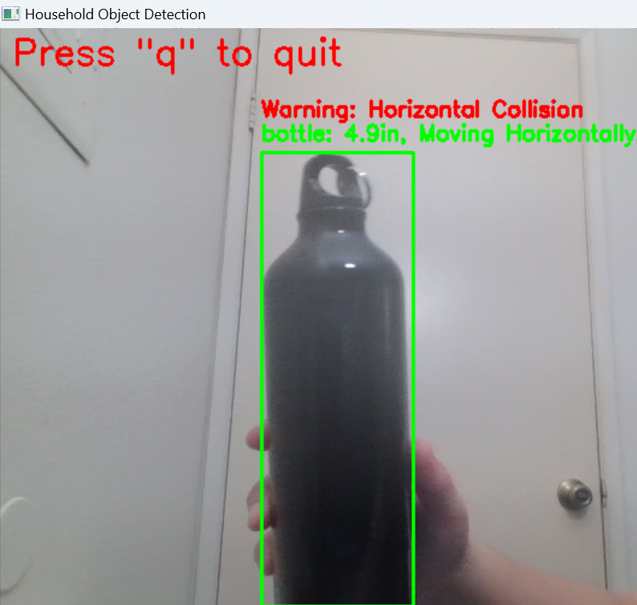
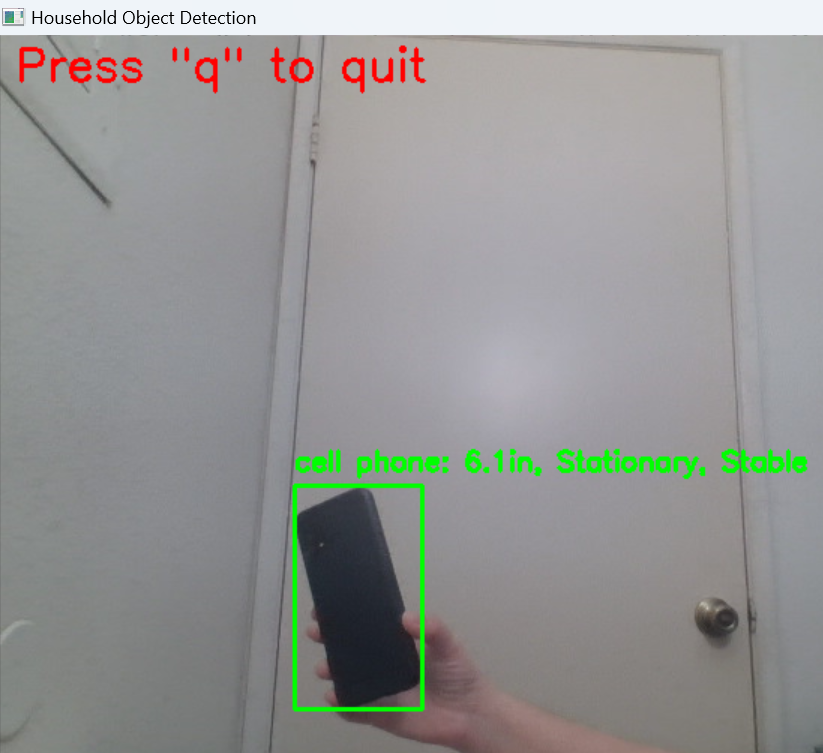
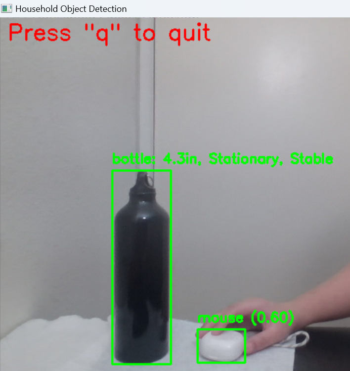

# Real-Time 3D Perception System

A real-time object detection and tracking system that identifies household objects, estimates their distances, analyzes their motion patterns, and predicts potential collisions. Built using YOLOv8 and OpenCV.

## Features

- **Real-time Object Detection**: Identifies 20+ household objects using YOLOv8
- **Distance Estimation**: Calculates real-world distances to detected objects
- **Motion Analysis**: Tracks object movement patterns and speeds
- **Collision Prediction**: Predicts potential collisions based on object trajectories
- **Stability Monitoring**: Analyzes object stability through continuous state assessment

## Technologies Used

- YOLOv8 for object detection
- OpenCV for image processing and visualization
- Python for implementation
- NumPy for numerical computations

## Demo

### Object Detection and Tracking
The system can detect objects and analyze their motion states:

#### Moving Objects

*Detection of a moving bottle showing motion status, distance estimation, and collision prediction*

#### Stationary Objects

*Stable object detection with distance measurement and stability analysis*


*Multiple object class detection demonstrating system versatility*

## Setup and Installation

1. Clone the repository
```bash
git clone https://github.com/yourusername/Real-Time-3D-Perception.git
cd Real-Time-3D-Perception
```

2. Install required packages
```bash
pip install ultralytics opencv-python numpy
```

3. Run the application
```bash
python perception_system.py
```

## Usage

1. Launch the application
2. Point your camera at household objects
3. The system will:
  - Draw bounding boxes around detected objects
  - Display distance measurements
  - Show motion status and speed
  - Provide collision warnings when objects move toward boundaries
  - Indicate object stability status

## Calibration

The system uses predefined measurements for common objects:
- Chair: 30 inches
- Laptop: 16 inches
- Bottle: 4 inches
- Cell Phone: 6 inches

Add or modify calibration values in the `KNOWN_DISTANCES` dictionary for other objects.

## System Components

1. **Object Tracker**: Maintains object history and analyzes motion patterns
2. **Distance Calculator**: Uses triangle similarity for real-world distance estimation
3. **Collision Predictor**: Projects object trajectories to warn of potential collisions
4. **Stability Analyzer**: Monitors distance variations to assess object stability

## Requirements

- Python 3.8+
- Webcam or USB camera
- Libraries: ultralytics, opencv-python, numpy

## Future Improvements

- Multi-camera support for improved accuracy
- 3D pose estimation
- Object persistence across frames
- Dynamic calibration system
- Support for more object classes
